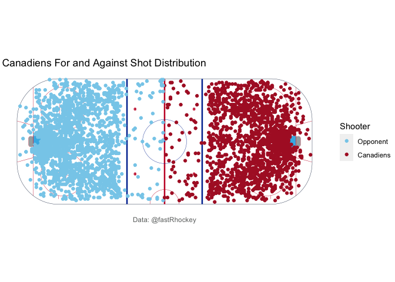
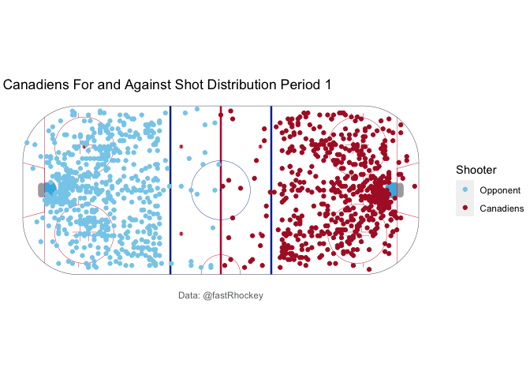
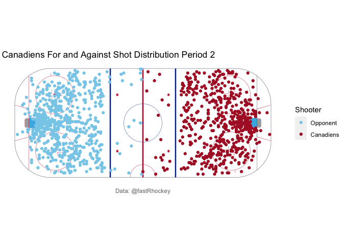
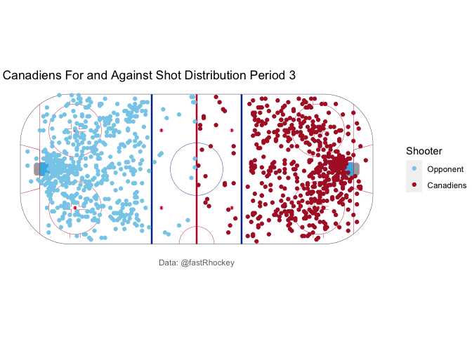

```r
#importing libraries
library(fastRhockey)
library(tidyverse)
library(dplyr)
library(ggplot2)
library(ggimage)
library(sportyR)
```

Let's use the fastRhockey library to first load play by play data from a particular team. Here we will choose the Montreal Canadiens. First we will get the list of game IDs for the Canadiens, and then use those game IDs to pull all the play by play data. First, lets find out what the team ID is for the Montreal Canadiens. 


```r
nhl_teams() %>% select('team_id','name') %>%
  head(10)
```

```
##    team_id                name
## 1        1   New Jersey Devils
## 2        2  New York Islanders
## 3        3    New York Rangers
## 4        4 Philadelphia Flyers
## 5        5 Pittsburgh Penguins
## 6        6       Boston Bruins
## 7        7      Buffalo Sabres
## 8        8  Montréal Canadiens
## 9        9     Ottawa Senators
## 10      10 Toronto Maple Leafs
```
As you can see, the team ID for the Montreal Canadiens is 8. The function nhl_teams() also tells us other useful information like the location and venue ID.


```r
schedules <- load_nhl_schedule(2022) %>%
  filter(home_team_id == 8 | away_team_id == 8)
schedules %>%
  select(away_team_id,away_team_name,home_team_id, home_team_name,  game_date, away_score, home_score) %>%
  head()
```

```
## # A tibble: 6 × 7
##   away_team_id away_team_name  home_team_id home_team_name game_date  away_score
##          <int> <chr>                  <int> <chr>          <date>          <int>
## 1            7 Buffalo Sabres             8 Montréal Can… 2022-02-13          5
## 2           29 Columbus Blue …            8 Montréal Can… 2022-02-12          2
## 3           15 Washington Cap…            8 Montréal Can… 2022-02-11          5
## 4            1 New Jersey Dev…            8 Montréal Can… 2022-02-09          7
## 5           29 Columbus Blue …            8 Montréal Can… 2022-01-31          6
## 6           22 Edmonton Oilers            8 Montréal Can… 2022-01-30          7
## # … with 1 more variable: home_score <int>
```
The above cell loads in the schedule data for the given season, filters to select only games in which either the home or away team is the Montreal Canadiens. Then we can preview the data that we have just filtered out using the head() command. The select function allows us to choose which variables we want to view in our preview. As you can see the most recent game the Canadiens played was against the Columbus Blue Jackets, one in which they lost 6-3. 

You might check this with the official NHL website or another sports page and see that the date is listed as January 30th, and not January 31st as listed above. This is likely because the stats update overnight, so the api records the date as the when the stats are updated. The exact date of the game is usually of little importance, but if you need to change this you could simply update it using the mutate() function. 

Now lets use the schedule data to pull some relevant data and do something interesting. 


```r
pre_all <- vector("list", nrow(schedules)) #pre-allocated list

for (val in schedules$game_id) {
  pre_all[[which(val == schedules$game_id)]] <- nhl_game_feed(val)$all_plays %>%
    filter(result_event_type_id == "SHOT") #combining together all the plays
}

habs_game_feed <- do.call(rbind, pre_all)
```
 Note that the above code is a bit slow, but since the NHL play by play data does not include game ID information or home/away team information, this seems to be the only way to filter out the play by play data by team. 


```r
habs_shot_data <- habs_game_feed %>% #filter to get shots on goal
  filter(result_event_type_id=="SHOT") %>%
  select(team_name, result_description, coordinates_x, coordinates_y, about_period)

habs_shot_data <- habs_shot_data %>% #put one team on each side of the rink 
  mutate(coordinates_x = if_else(team_name != 'Montréal Canadiens', -abs(coordinates_x), abs(coordinates_x))) %>%
  mutate(Shooter = if_else(team_name != 'Montréal Canadiens', 'Opponent', 'Canadiens'))
```

The above code filters the data to select all plays involving a shot on goal, and adding a value to determine if they shot was a Canadiens shot or a shot from a Canadiens opponent. 


```r
nhl_rink = geom_hockey('nhl',
                       boards_color= '#13294b') #create the NHL rink
nhl_rink +
  geom_point(data = habs_shot_data, aes(coordinates_x, coordinates_y, color = Shooter)) +
  scale_color_manual(values = c("Opponent" = '#87ceeb','Canadiens' = '#AF1E2D')) +
  #titles and caption
  labs(title = "Canadiens For and Against Shot Distribution",
       caption = "Data: @fastRhockey")
```

<!-- -->

Unsurprisingly, both the Canadiens and their opponents have their shots concentrated  close to the goal and spreading out in an outward V shape pattern, as good defense typically aims to clog up the middle and force the opponent to the edges of the rink. Now, lets see how or if this pattern changes as a function of time throughout the game. We can utilize our work from earlier and filter based on period.


```r
habs_shot_data_p1 <- habs_shot_data %>% #filter based upon period 
  filter(about_period == 1)
habs_shot_data_p2 <- habs_shot_data %>%
  filter(about_period == 2)
habs_shot_data_p3 <- habs_shot_data %>%
  filter(about_period == 3)

nhl_rink = geom_hockey('nhl',
                       boards_color= '#13294b') #create the NHL rink
nhl_rink +
  geom_point(data = habs_shot_data_p1, aes(coordinates_x, coordinates_y, color = Shooter)) +
  scale_color_manual(values = c("Opponent" = '#87ceeb','Canadiens' = '#AF1E2D')) +
  #titles and caption
  labs(title = "Canadiens For and Against Shot Distribution Period 1",
       caption = "Data: @fastRhockey")
```

<!-- -->

```r
nhl_rink = geom_hockey('nhl',
                       boards_color= '#13294b') #create the NHL rink
nhl_rink +
  geom_point(data = habs_shot_data_p2, aes(coordinates_x, coordinates_y, color = Shooter)) +
  scale_color_manual(values = c("Opponent" = '#87ceeb','Canadiens' = '#AF1E2D')) +
  #titles and caption
  labs(title = "Canadiens For and Against Shot Distribution Period 2",
       caption = "Data: @fastRhockey")
```

<!-- -->

```r
nhl_rink = geom_hockey('nhl',
                       boards_color= '#13294b') #create the NHL rink
nhl_rink +
  geom_point(data = habs_shot_data_p3, aes(coordinates_x, coordinates_y, color = Shooter)) +
  scale_color_manual(values = c("Opponent" = '#87ceeb','Canadiens' = '#AF1E2D')) +
  #titles and caption
  labs(title = "Canadiens For and Against Shot Distribution Period 3",
       caption = "Data: @fastRhockey")
```

<!-- -->

As expected, the pattern holds, as its unlikely strategy on shot location changes very much from period to period. That's it for this tutorial on how to load and explore data using fastRhockey. 

